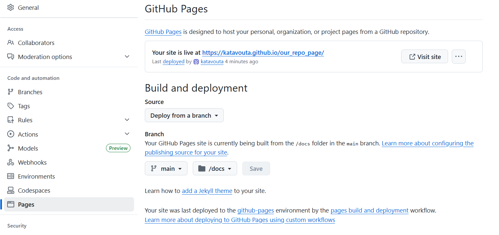

# Our NEMO repo page
A guide to create a page for your repo. Please follow the below steps.

---

## STEP 1

clone this git repository: 
<a href="https://github.com/katavouta/our_repo_page.git">https://github.com/katavouta/our_repo_page.git</a>

---

## STEP 2

Go to the repository you cloned and then in **settings < Pages** in Build and deployment choose: **deploy from a branch**
and in the branch choose **main / docs**

Essentially it should look something like this:

  

---

## STEP3

All the information for the webpage is within the docs. All the text that appears is within these **.md** files.
For example, you can change the text within the index.md for the main page, and you can change the text within page1.md 
for this extra pages that appear in your web (if you want to have extra pages)

If you want to create an additional **page** in your web simply create a new .md file within docs (name it what you want).

---

## Markdown 

All these md files are essentially written in Markdown. You can find information about syntax and rules for markdown here:
<a href="https://www.markdownguide.org/cheat-sheet/">https://www.markdownguide.org/cheat-sheet/</a>

